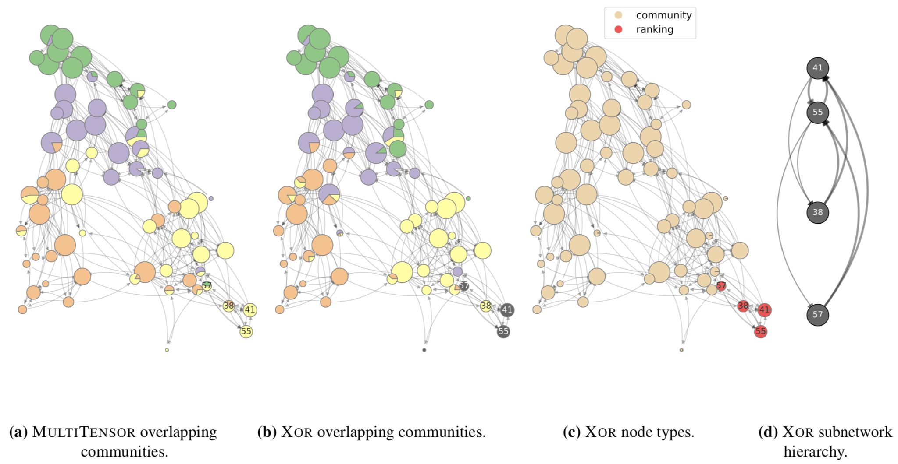

# XOR: community detection and ranking extraction in networks

Python implementation of XOR algorithm described in:

- [1] Iacovissi L. and De Bacco C. (2022). _The interplay between ranking and communities in networks_, Sci Rep 12, 8992, https://doi.org/10.1038/s41598-022-12730-3. 

If you use this code please cite this [article](https://www.nature.com/articles/s41598-022-12730-3) (_published version, open access_) or this [article](http://arxiv.org/abs/2112.12670) (_preprint_).

We present a new generative model based on an interplay between the community and hierarchical structures. It assumes each node to have a preference between the homophily-based (community) and the competition-based (hierarchy) interaction mechanisms. Nodes with the same predilection are more likely to interact, while heterogeneous interactions are still allowed. Using variational inference, we derive an inference model capable of accurately learn node types, communities and node ranking.

Copyright (c) 2021 [Laura Iacovissi](https://github.com/liacov) and [Caterina De Bacco](http://cdebacco.com).


<p align="center">
<br>
</p>

Permission is hereby granted, free of charge, to any person obtaining a copy of this software and associated documentation
files (the "Software"), to deal in the Software without restriction, including without limitation the rights to use, copy, modify,
merge, publish, distribute, sublicense, and/or sell copies of the Software, and to permit persons to whom the Software is furnished
to do so, subject to the following conditions:

The above copyright notice and this permission notice shall be included in all copies or substantial portions of the Software.

THE SOFTWARE IS PROVIDED "AS IS", WITHOUT WARRANTY OF ANY KIND, EXPRESS OR IMPLIED, INCLUDING BUT NOT LIMITED TO THE WARRANTIES OF
MERCHANTABILITY, FITNESS FOR A PARTICULAR PURPOSE AND NON INFRINGEMENT. IN NO EVENT SHALL THE AUTHORS OR COPYRIGHT HOLDERS BE LIABLE
FOR ANY CLAIM, DAMAGES OR OTHER LIABILITY, WHETHER IN AN ACTION OF CONTRACT, TORT OR OTHERWISE, ARISING FROM, OUT OF OR IN CONNECTION
WITH THE SOFTWARE OR THE USE OR OTHER DEALINGS IN THE SOFTWARE.

## What's included
- `src` : Contains the Python implementation of XOR algorithm, the code for performing the cross-validation procedure and the code
  for generating benchmark synthetic data with intrinsic community and hierarchical structure. More information can be found
  [here](https://github.com/liacov/XOR-rankcom/tree/main/src).
- `data/input` : Contains an example of directed network having an intrinsic community structure and a given reciprocity value,
  and some example files to initialize the latent variables. They are synthetic data.
- `data/output` : Contains some results to test the code.

## How to use
To download this repository, copy and paste the following:

```bash
git clone https://github.com/liacov/XOR-rankcom
```

The project has been developed using Python 3.7 with the packages contained in *requirements.txt*. We suggest to create a conda
environment with `conda create --name XOR python=3.7.9 --no-default-packages`, activate it with `conda activate XOR`, and install
all the dependencies by running (inside `XOR` directory):

```bash
pip install -r requirements.txt
```

For more information, refer to the documentation provided [here](https://github.com/liacov/XOR-rankcom/tree/main/src/README.md). 

## Want to try it? 
Check out the notebook demo [`src/XOR_demo.ipynb`](./src/XOR_demo.ipynb).
